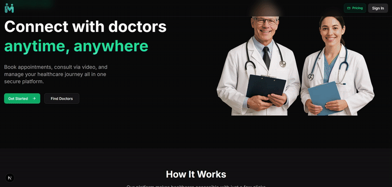

# 🩺 MediMeet - Full Stack Doctors Appointment Platform

**MediMeet** is a modern, scalable, and responsive **SaaS-based Doctors Appointment Platform** built with the latest full stack technologies.

> 👨‍⚕️ Patients can **book appointments**, **video call doctors**, and **manage sessions**, while doctors can manage their availability — all in real-time and securely via **Clerk authentication**.

---

## 🧠 Key Features

- ✅ Book appointments based on real-time doctor availability
- 🔐 User authentication & role management with **Clerk**
- 📹 Seamless live **video calls with Vonage**
- 📆 Dynamic time slot selection and management
- 🖥️ Beautiful responsive UI with dark/light mode
- 🚀 SaaS-ready structure with extendable backend
- 🎯 Clean code architecture using App Router and modular components

---

## 🛠️ Tech Stack

| Technology       | Purpose                                  |
|------------------|------------------------------------------|
| **Next.js 14**   | Full-stack React framework               |
| **Tailwind CSS** | Utility-first styling                    |
| **Shadcn UI**    | Elegant, accessible UI components        |
| **Clerk**        | Authentication & user management         |
| **Neon**         | Scalable PostgreSQL database             |
| **Vonage Video API** | Real-time video consultations       |
| **Lucide Icons** | Minimalistic and modern icons            |
| **GSAP** (optional) | Smooth animations & scroll effects    |

---
